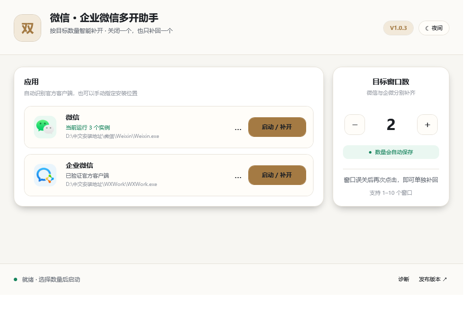
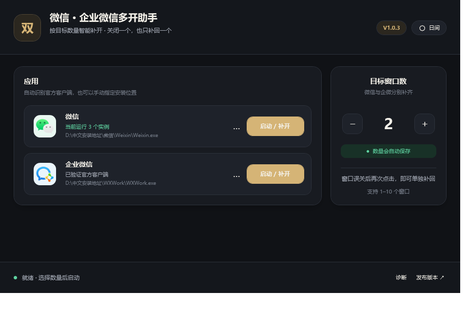
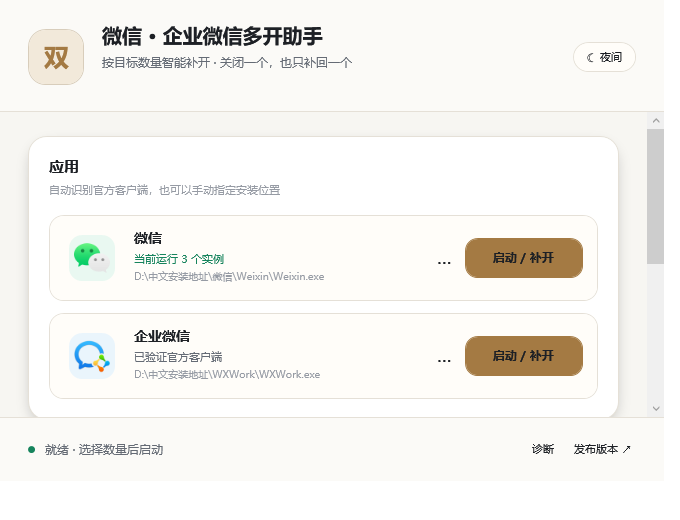
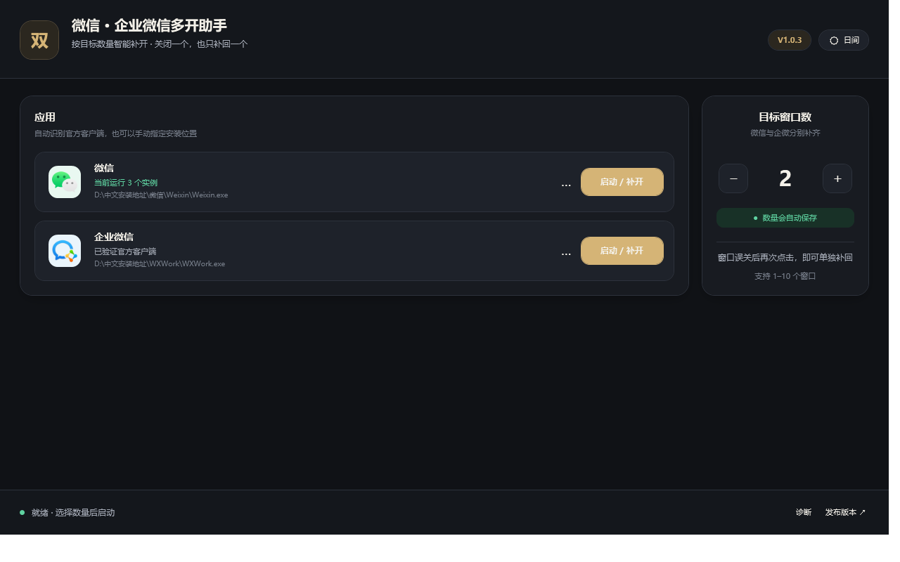

# 微信 · 企业微信多开助手

[](https://github.com/PascalePaF/wechat-wecom-duokai/releases)


[](LICENSE)

一个面向 Windows 10/11 的轻量级微信、企业微信多开与补开工具。它识别已经运行的真实客户端
实例，只启动距离目标数量还缺少的窗口；误关一个窗口后，无需退出其他微信，重新点击即可只补回一个。

> 本项目基于 [CN-Root/wechat-wecom-duokai](https://github.com/CN-Root/wechat-wecom-duokai)
> 持续改进。不会修改、替换或破解微信与企业微信客户端文件。



## V1.0.3 有什么变化

- 安装或升级时，如果目标目录中的助手正在运行，会先让用户选择是否正常关闭；五秒后仍未退出时，
  再单独确认是否强制关闭。匹配范围只限所选安装目录中的 `wechat_duokai.exe`，不会关闭微信或企业微信。
- 主窗口可以自由拖动边缘缩放、最大化到整块屏幕；最小尺寸为 680×520。窄窗口自动把数量卡片移到
  应用卡片下方，宽屏仍将数量保持在最右侧。
- 启用 Per-Monitor V2 DPI 感知，文字使用 WPF 理想排版，圆角和阴影由矢量资源绘制；日间、夜间主题继续保留。
- 每个客户端卡片新增一个低干扰的 `…` 按钮，可手动选择安装在任意位置的官方客户端。
  所选文件必须同时通过文件名、产品信息和有效腾讯 Authenticode 签名验证。
- 新增页脚“诊断”按钮。报告只写入程序同目录的 `diagnostics` 文件夹，不自动上传，也不读取聊天或账号数据。
- 启动时自动读取 GitHub 最新 Release 的版本号；发现新版本后只提示并打开 GitHub 发布页，
  客户端不下载、不替换、不静默更新自身。
- 安装器与清理器改为不同程序集、不同产品描述和不同二进制，不再把安装器复制改名为清理器。
- 底层进程枚举、父子关系、启动和等待已抽象为可替换的进程环境，主逻辑可以在不启动真实客户端时测试。
- 自动回归覆盖 680×520、790×600、960×640、1280×800、1920×1080，以及两套主题和三个发布窗口。

完整记录见 [CHANGELOG.md](CHANGELOG.md)，技术选择、代码签名费用和 WiX/MSI 结论见
[V1.0.3 技术决策与兼容性报告](docs/V1.0.3-技术决策与兼容性报告.md)。

## 主要能力

| 能力 | 行为 |
| --- | --- |
| 按需补开 | 目标为 3、误关 1 个后，再次点击只补开缺少的 1 个 |
| 自动记忆 | 保存最近一次 1–10 的目标窗口数 |
| 自动定位 | 从注册表、运行进程和官方常见目录识别客户端 |
| 自定义客户端 | 可选择任意安装目录中的微信/企业微信，必须通过腾讯签名验证 |
| 本地诊断 | 在应用目录生成版本、路径、签名和实例计数报告，不上传 |
| 更新提示 | 只读取公开 GitHub Release 元数据，下载必须在浏览器中由用户完成 |
| 响应式界面 | 原生标题栏、自由缩放、最大化、日间/夜间主题和高 DPI 适配 |
| 两种发行方式 | 安装版与绿色免安装 ZIP；安装器和清理器身份分离 |
| 可核验发布 | 正式版本提供源码标签、SHA-256、自动测试和 Kaspersky 扫描日志 |
| 完整卸载 | 可保留源码清理程序，也可在多重校验后删除源码与全部发布包 |

## 下载

只从 [GitHub Releases](https://github.com/PascalePaF/wechat-wecom-duokai/releases) 下载正式版本。

| 文件 | 适用场景 |
| --- | --- |
| `wechat_duokai-setup-v1.0.3.exe` | 推荐；可选择本机安装地址，并加入开始菜单和“已安装的应用” |
| `wechat_duokai-portable-v1.0.3.zip` | 绿色版；解压完整目录后直接运行 |
| `wechat_duokai-cleanup-v1.0.3.exe` | 独立完整卸载与清理工具；与安装器不是同一个二进制 |
| `SHA256SUMS.txt` | 核对下载内容是否与发布文件一致 |
| `kaspersky-scan-v1.0.3.txt` | Kaspersky 对完整发布目录的原始扫描日志 |

当前版本尚未配置受公共信任的代码签名。首次运行可能出现“未知发布者”或信誉提示；这不等于
文件一定有病毒，也不能被当作安全证明。请核对来源和 SHA-256，让本机安全软件保持开启；不要为了
运行本工具而关闭防护或设置永久白名单。代码签名方案见[技术报告](docs/V1.0.3-技术决策与兼容性报告.md#4-代码签名是否需要花钱)。

## 安装和升级

1. 下载并运行 `wechat_duokai-setup-v1.0.3.exe`。
2. 使用“选择文件夹”选择或新建一个专用安装目录；路径不需要手动输入。
3. 选择是否创建桌面快捷方式，然后点击“立即安装”。
4. 如果同一安装目录的旧助手正在运行，按提示选择关闭或取消。安装器不会处理其他目录中的助手，
   也不会结束微信或企业微信。
5. 安装完成后应用仍保持未启动；只有点击“确认并启动”才会运行，也可选择“稍后启动”。


## 绿色版

1. 将 `wechat_duokai-portable-v1.0.3.zip` 解压到独立文件夹。
2. 运行 `wechat_duokai.exe`。
3. 请勿只把主 EXE 移走；它需要同目录的 `WechatDuokai.Core.dll`，完整目录也包含安全标记与清理器。

## 使用方法

1. 在最右侧设置希望保持的目标窗口数，范围为 1–10。
2. 点击微信或企业微信的“启动 / 补开”。
3. 程序会统计真实根实例，并只启动缺少的数量。
4. 如果没有自动找到客户端，点击相应卡片中的 `…`，选择官方程序：
   微信为 `Weixin.exe` 或 `WeChat.exe`，企业微信为 `WXWork.exe`。
5. 如需排查兼容问题，点击页脚“诊断”。报告只保存在当前程序目录的 `diagnostics` 文件夹。

目标数量与自定义路径保存在 `%LOCALAPPDATA%\WechatDuokai\settings.ini`。自定义路径使用 Base64
保存只是为了避免特殊字符破坏配置格式，不是加密；配置不包含账号、聊天内容或凭据。

<details>
<summary>查看夜间主题与尺寸适配</summary>







</details>

## 工作原理

```text
主界面 MainWindow
├─ ApplicationLocator             注册表、进程、常见目录与用户自选路径
├─ ClientExecutableValidator      文件名 + 产品信息 + 腾讯签名验证
├─ InstanceManager                目标数量、真实根实例和增量启动编排
│  ├─ IProcessEnvironment         枚举、父子关系、启动、等待的可测试边界
│  └─ WindowsHandleUnlocker       仅处理已知单实例锁白名单
├─ DiagnosticReportService        仅写本地 diagnostics 报告
├─ ReleaseUpdateChecker           只读 GitHub 最新 Release 版本号
└─ UserPreferences                保存数量与已验证客户端路径

发布程序
├─ setup                           只负责安装与升级
├─ cleanup                         只负责卸载/完整清理及临时清理工作进程
└─ build-release.ps1               重编译、测试、组包、清单与 SHA-256
```

微信 4.x 的一个窗口会产生多个同名子进程，所以不能直接把同名进程总数当作窗口数。本项目按父子
关系归并为根实例，再用“目标数量 − 当前根实例数”计算缺口。微信 3.x/4.x 的可执行文件命名和两代
锁策略都保留；企业微信同时使用其当前用户 `multi_instances` 提示和精确互斥锁回退。

## 安全与隐私边界

- 不注入 DLL，不创建远程线程，不写客户端内存。
- 不修改、替换或破解微信、企业微信文件。
- 不结束微信或企业微信进程；覆盖安装只处理目标安装目录里的本助手。
- 不读取聊天数据库、消息、联系人、账号、Cookie 或登录凭据。
- 诊断报告仅写本地，不自动上传。
- 唯一自动网络请求是向 `api.github.com` 读取本项目最新 Release 的 `tag_name`；不下载附件，
  不发送诊断报告。点击更新入口后由系统浏览器打开 GitHub。
- 只对已验证客户端路径、当前 Windows 会话及已知锁名/精确 `lock.ini` 路径执行兼容操作。
- 自定义客户端必须有有效腾讯 Authenticode 签名；同名的未签名 EXE 会被拒绝。
- 卸载目标必须同时通过专用标记、目录结构、精确路径和链接检查；删除源码还要额外勾选和确认。

安全资料：

- [V1.0.3 完整安全审计报告](docs/微信企业微信多开助手_V1.0.3_完整安全审计报告.txt)
- [V1.0.3 技术决策与兼容性报告](docs/V1.0.3-技术决策与兼容性报告.md)
- [V1.0.1 源码与旧版二进制安全审计（历史）](SECURITY-AUDIT.md)
- [旧版 EXE 硬编码路径说明](docs/旧版EXE硬编码路径说明与风险评估报告.txt)

反病毒“未检出”是证据，不是绝对安全保证。源码、标签、构建脚本、哈希和原始扫描日志同时公开，
用于让每个发布文件都可以独立复核。

## 完全卸载

从开始菜单“完全卸载”、Windows“已安装的应用”，或运行独立清理工具进入：

1. **删除程序与全部发布包，保留源码**：删除已验证安装目录、快捷方式、安装包、绿色版和用户设置，
   保留本地 Git 仓库。
2. **全部删除，包括源码与全部发布包**：只有源码目录带正确标记且结构匹配时可选；还需要额外复选
   和最后一次确认。未提交的源码修改不可恢复。


## 从源码构建

### 环境

- Visual Studio 2019 或更高版本
- .NET Framework 4.8 Developer Pack
- MSBuild
- Windows 10/11 x64

项目没有第三方运行时包或 NuGet UI 依赖。

```powershell
MSBuild .\duokai.sln /restore /t:Rebuild /p:Configuration=Release
.\tests\bin\Release\net48\WechatDuokai.Tests.exe
PowerShell -ExecutionPolicy Bypass -File .\build-release.ps1 -Version 1.0.3
```

发布目录为 `artifacts\V1.0.3`。脚本分别复制真正的 setup 与 cleanup 输出，并生成绿色版、发布清单
和 SHA-256。界面回归矩阵可用 `scripts\capture-ui-matrix.ps1` 重新生成。

## 兼容性说明

- 自动识别与手动选择覆盖微信旧版 `WeChat.exe`、微信 4.x `Weixin.exe` 和企业微信 `WXWork.exe`；
  不以小版本号作为白名单，因此官方维护版本升级不会仅因版本号变化被拒绝。
- V1.0.3 真机验证：微信 `4.1.15.6`、企业微信 `5.0.11.6018`、Windows 11 x64，二者腾讯签名有效。
- 支持 Windows 10/11 的 100%、125%、150%、175%、200% 缩放逻辑；Per-Monitor V2 允许跨显示器
  重新缩放。每种显卡驱动、辅助技术和超长本地路径仍需社区反馈继续覆盖。
- 腾讯没有公开承诺第三方多开机制长期稳定。客户端改变锁机制时，本工具会失败关闭，不会转向注入
  或修改客户端；请先用测试账号验证，并遵守客户端许可和组织规定。
- V1.0.3 继续使用 WPF/.NET Framework 4.8。现在迁移 WinUI 3、Tauri 或 Python 不会提升底层兼容性，
  反而会扩大安装体积和供应链；详见技术报告。

## 版本来源

- 上游：[CN-Root/wechat-wecom-duokai](https://github.com/CN-Root/wechat-wecom-duokai)
- 本项目：[PascalePaF/wechat-wecom-duokai](https://github.com/PascalePaF/wechat-wecom-duokai)
- V1.0.0：数量缓存、增量补开、安装/绿色版和完整清理
- V1.0.1：自选安装地址、可移动窗口、双主题和扩展安全审计
- V1.0.2：WPF 矢量界面、安装后确认启动、Core 分层和同类项目研究
- V1.0.3：运行中安全覆盖、腾讯签名路径验证、本地诊断、浏览器更新、响应式布局和独立清理器

## 许可证

项目继承上游的 [Apache License 2.0](LICENSE)。原作者与历次贡献者的版权声明予以保留。
