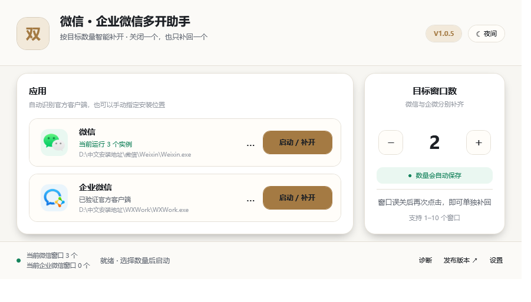
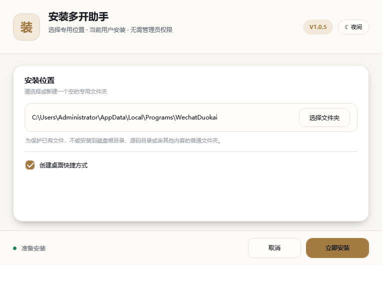
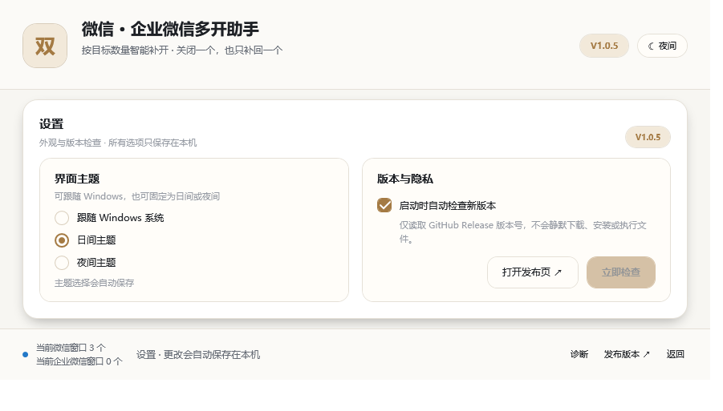
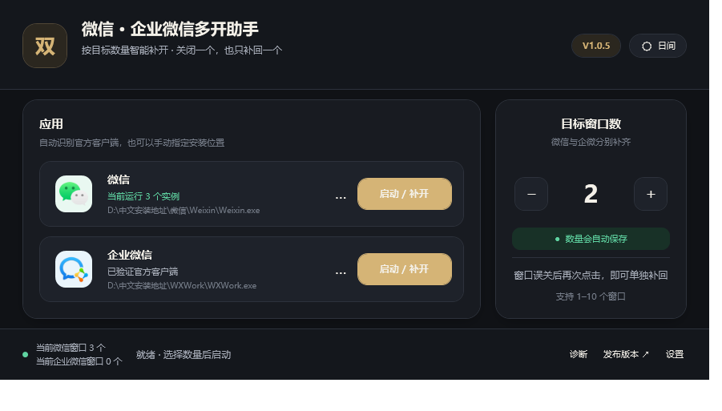
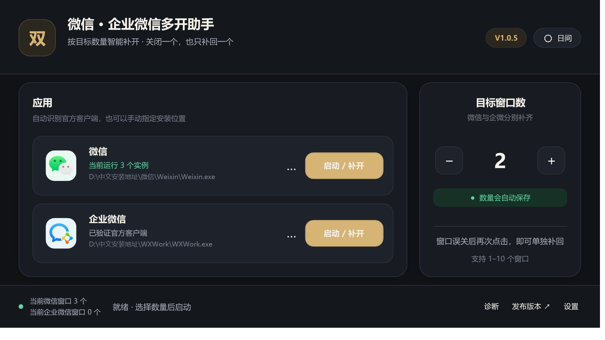
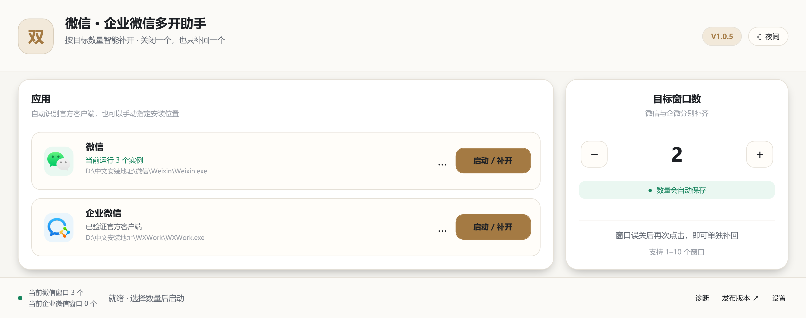
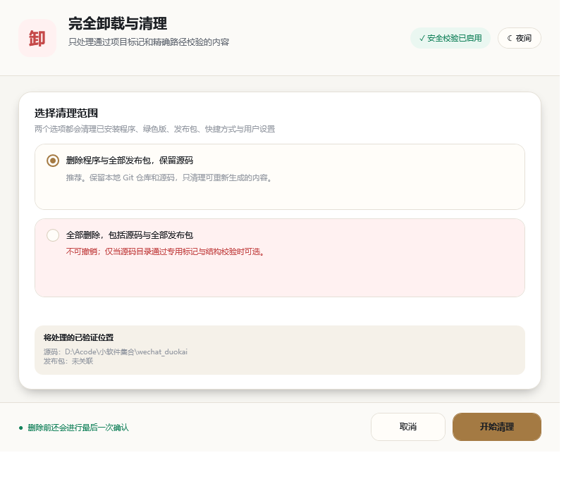

# 微信 · 企业微信多开助手

[](https://github.com/PascalePaF/wechat-wecom-duokai/releases)
[](https://github.com/PascalePaF/wechat-wecom-duokai/actions/workflows/windows-release-validation.yml)


[](LICENSE)

一个面向 Windows 10/11 的轻量级微信、企业微信多开与补开工具。它统计当前用户会话中、来自同一
官方程序路径的真实根实例，只启动距离目标数量还缺少的窗口；误关一个窗口后，无需退出其余客户端，
再次点击即可只补回一个。

> 本项目基于 [CN-Root/wechat-wecom-duokai](https://github.com/CN-Root/wechat-wecom-duokai)
> 持续改进。不会修改、替换或破解微信与企业微信客户端文件，也不是腾讯官方产品。



## V1.0.5 有什么变化

- 左下角新增两行实时状态：分别显示当前微信和企业微信根窗口数量，每 2 秒刷新。
- 右下角最右侧新增“设置”；在同一窗口内切换设置页，不增加滚动条或第二个难以管理的窗口。
- 主题可选择跟随 Windows、固定日间或固定夜间；可控制是否在启动时检查 GitHub 新版本，也能手动检查。
- “自动更新”保持安全边界：只自动检查公开 Release 版本号，不在客户端内静默下载、安装或执行文件。
- 企业微信注册表恢复增加外部冲突保护：只有 `multi_instances` 仍等于本助手的临时状态才恢复旧值；
  第三方在启动期间写入的新值会被保留。
- 新增 GitHub Actions 干净 Windows 构建门禁：重建、完整测试、SHA-256 复核、SPDX 2.2 SBOM 生成与验证。
- UI 自动回归扩展到 12 个样本，新增设置页日间/夜间最小尺寸检查。
- 按项目决定仍不推进付费、自签或托管代码签名；继续通过公开源码、标签、哈希、SBOM、测试报告和
  Kaspersky 原始扫描日志提供可核验证据。

完整记录见 [CHANGELOG.md](CHANGELOG.md)。设置、计数、注册表冲突算法与 CI 门禁见
[V1.0.5 设置、实时状态与注册表冲突保护验证报告](docs/V1.0.5-设置状态与注册表冲突保护验证报告.md)。

## 主要能力

| 能力 | 行为 |
| --- | --- |
| 按需补开 | 目标为 3、误关 1 个后，再次点击只补开缺少的 1 个 |
| 自动记忆 | 保存最近一次 1–10 的目标窗口数 |
| 实时状态 | 左下角分两行显示当前微信与企业微信根窗口数量 |
| 设置中心 | 跟随系统/日间/夜间主题，启动检查开关和手动版本检查 |
| 企业微信扩展模式 | 当前官方 5.0.11.6018 已实测三开；外部新注册表值不会被旧快照覆盖 |
| 自动定位 | 从注册表、运行进程和官方常见目录识别客户端 |
| 自定义客户端 | 可选择任意安装目录中的微信/企业微信，必须通过腾讯签名验证 |
| 本地诊断 | 在应用目录生成版本、路径、签名、实例计数和策略报告，不上传 |
| 更新提示 | 只读取公开 GitHub Release 元数据，下载必须在浏览器中由用户完成 |
| 比例界面 | 901×513 起，原生标题栏、自由缩放、最大化、双主题和 Per-Monitor V2 DPI |
| 两种发行方式 | 安装版与绿色免安装 ZIP；安装器和清理器为不同编译身份 |
| 可核验发布 | 源码标签、SHA-256、SPDX SBOM、干净 Windows CI、UI 矩阵和 Kaspersky 日志 |
| 完整卸载 | 可保留源码清理程序，也可在多重校验后删除源码与全部发布包 |

## 下载

只从 [GitHub Releases](https://github.com/PascalePaF/wechat-wecom-duokai/releases) 下载正式版本。

| 文件 | 适用场景 |
| --- | --- |
| `wechat_duokai-setup-v1.0.5.exe` | 推荐；可选择本机安装地址，并加入开始菜单和“已安装的应用” |
| `wechat_duokai-portable-v1.0.5.zip` | 绿色版；解压完整目录后直接运行 |
| `wechat_duokai-cleanup-v1.0.5.exe` | 独立完整卸载与清理工具；与安装器不是同一个二进制 |
| `SHA256SUMS.txt` | 核对下载内容是否与发布文件一致 |
| `manifest.spdx.json` | Microsoft SBOM Tool 生成并验证的 SPDX 2.2 软件物料清单 |
| `kaspersky-scan-v1.0.5.txt` | Kaspersky 对完整发布目录的原始扫描日志 |

当前版本没有受公共信任的 Authenticode 代码签名。首次运行可能出现“未知发布者”、SmartScreen 或
第三方启发式信誉提示；这不等于文件一定有病毒，也不能反过来当作安全证明。请核对下载域名、Release
标签和 SHA-256，让本机安全软件保持开启。若安全软件报出明确告警，应先隔离并核查报告、哈希和源码，
不要盲目点击忽略，也不要为运行本工具关闭防护或设置永久白名单。

## 安装和升级

1. 下载并运行 `wechat_duokai-setup-v1.0.5.exe`。
2. 使用“选择文件夹”选择或新建一个专用安装目录；路径不需要手动输入。
3. 选择是否创建桌面快捷方式，然后点击“立即安装”。
4. 如果同一安装目录的旧助手正在运行，按提示选择关闭或取消。安装器只处理该目录中的助手，
   不会结束微信、企业微信或其他目录中的同名程序。
5. 安装完成后应用仍保持未启动；只有点击“确认并启动”才会运行，也可选择“稍后启动”。



## 绿色版

1. 将 `wechat_duokai-portable-v1.0.5.zip` 解压到一个独立文件夹。
2. 运行 `wechat_duokai.exe`。
3. 不要只把主 EXE 移走；它需要同目录的 `WechatDuokai.Core.dll`，完整目录还包含许可证、安全说明和清理器。

## 使用方法

1. 在最右侧设置希望保持的目标窗口数，范围为 1–10。
2. 点击微信或企业微信的“启动 / 补开”。
3. 程序会统计真实根实例，并只启动缺少的数量。
4. 如果没有自动找到客户端，点击相应卡片中的 `…`，选择官方程序：微信为 `Weixin.exe` 或
   `WeChat.exe`，企业微信通常为 `WXWork.exe`。
5. 如需排查兼容问题，点击页脚“诊断”。报告只保存在当前程序目录的 `diagnostics` 文件夹。
6. 页脚左侧会持续显示两类客户端的当前根窗口数量；点击最右侧“设置”可选择主题和版本检查行为。

目标数量与自定义路径保存在 `%LOCALAPPDATA%\WechatDuokai\settings.ini`。自定义路径使用 Base64
保存只是为了避免特殊字符破坏配置格式，不是加密；配置不包含账号、聊天内容或凭据。

### 企业微信三开说明

企业微信当前的 `multi_instances` 注册表入口只可靠表达双开。在本机 `WXWork 5.0.11.6018` 上，把它
直接设置为 `3` 仍只能得到两个根实例；V1.0.5 因此不会把任意目标数量永久写入注册表。目标大于 2 时，
程序只在本次启动循环内暂时避开这条双开提示，并在每次补开前处理已知独占锁。真机已验证三个窗口，
但界面允许的 `4–10` 不是对每个企业微信版本的保证；客户端或组织策略变化时可能失败。

恢复注册表前会比较当前值、类型和存在状态。只有它仍等于本助手写入的临时状态时才恢复旧快照；如果
第三方程序在启动期间写入了新设置，本助手会保留第三方的新值。由于普通注册表值没有跨进程原子
compare-and-swap，这是一项尽力而为的冲突保护，而不是数据库级事务。

### 设置与版本检查

设置页提供“跟随 Windows / 日间 / 夜间”三种主题偏好，以及“启动时自动检查新版本”开关。关闭开关后
仍可手动检查。检查只读取 GitHub Release 版本号；程序不会自动下载或安装，所有下载都必须在浏览器中
由用户完成。



<details>
<summary>查看夜间主题与大尺寸适配</summary>







</details>

## 工作原理

```text
主界面 MainWindow
├─ 比例缩放画布                   901×513 基准；统一缩放并按比例填满窗口
├─ 主界面 / 设置页                同窗切换；实时计数、主题和版本检查偏好
├─ ApplicationLocator             注册表、进程、常见目录与用户自选路径
├─ ClientExecutableValidator      文件名 + 产品信息 + 腾讯签名验证
├─ InstanceManager                目标数量、真实根实例和增量启动编排
│  ├─ IProcessEnvironment         枚举、父子关系、启动、等待的可测试边界
│  ├─ IWeComLaunchPolicy          短期注册表会话、外部冲突检测与条件恢复
│  └─ WindowsHandleUnlocker       仅处理已知单实例锁白名单
├─ DiagnosticReportService        仅写本地 diagnostics 报告
├─ ReleaseUpdateChecker           只读 GitHub 最新 Release 版本号
└─ UserPreferences                保存数量、更新检查开关与已验证客户端路径

发布程序
├─ setup                           只负责安装与升级
├─ cleanup                         只负责卸载/完整清理及临时清理工作进程
├─ build-release.ps1               重编译、测试、组包、清单与 SHA-256
└─ GitHub Actions                  干净 Windows 重建、哈希复核与 SPDX SBOM
```

微信 4.x 的一个窗口会产生多个同名子进程，所以不能直接把同名进程总数当作窗口数。本项目按父子
关系归并为根实例，再用“目标数量 − 当前根实例数”计算缺口。微信 3.x/4.x 的可执行文件命名和两代
锁策略都保留；企业微信将注册表提示限制在短期作用域，并以精确独占锁作为补开机制。

## 安全与隐私边界

- 不注入 DLL，不创建远程线程，不写客户端内存。
- 不修改、替换或破解微信、企业微信文件。
- 不结束微信或企业微信进程；覆盖安装只处理目标安装目录里的本助手。
- 不读取聊天数据库、消息、联系人、账号、Cookie 或登录凭据。
- 诊断报告仅写本地，不自动上传。
- 用户启用启动检查时，唯一自动网络请求是向 `api.github.com` 读取本项目最新 Release 的 `tag_name`；
  可在设置中关闭。不下载附件，不发送诊断报告；点击更新入口后由系统浏览器打开 GitHub。
- 只对已验证客户端路径、当前 Windows 会话及已知锁名/精确 `lock.ini` 路径执行兼容操作。
- 企业微信注册表值在短期启动会话开始前保存；结束时仅在临时状态未被外部改动时恢复，不会把目标数量
  永久写成 3–10，也不会用旧快照覆盖第三方的新设置。
- 自定义客户端必须有有效腾讯 Authenticode 签名；同名的未签名 EXE 会被拒绝。
- 卸载目标必须同时通过专用标记、目录结构、精确路径和链接检查；删除源码还要额外勾选和确认。

安全资料：

- [V1.0.5 完整安全审计报告](docs/微信企业微信多开助手_V1.0.5_完整安全审计报告.txt)
- [V1.0.5 设置、实时状态与注册表冲突保护验证报告](docs/V1.0.5-设置状态与注册表冲突保护验证报告.md)
- [V1.0.5 UI 回归矩阵](docs/V1.0.5-UI回归矩阵.md)
- [V1.0.1 源码与旧版二进制安全审计（历史）](SECURITY-AUDIT.md)
- [旧版 EXE 硬编码路径说明](docs/旧版EXE硬编码路径说明与风险评估报告.txt)

反病毒“未检出”是证据，不是绝对安全保证。源码、标签、构建脚本、哈希和原始扫描日志同时公开，
用于让每个发布文件都可以独立复核。

## 完全卸载

从开始菜单“完全卸载”、Windows“已安装的应用”，或运行独立清理工具进入：

1. **删除程序与全部发布包，保留源码**：删除已验证安装目录、快捷方式、安装包、绿色版和用户设置，
   保留本地 Git 仓库。
2. **全部删除，包括源码与全部发布包**：只有源码目录带正确标记且结构匹配时可选；还需要额外复选
   和最后一次确认。未提交的源码修改不可恢复。



## 从源码构建

环境：Visual Studio 2019 或更高版本、.NET Framework 4.8 Developer Pack、MSBuild、Windows 10/11 x64。
项目没有第三方运行时包或 NuGet UI 依赖。

```powershell
MSBuild .\duokai.sln /restore /t:Rebuild /p:Configuration=Release
.\tests\bin\Release\net48\WechatDuokai.Tests.exe
PowerShell -ExecutionPolicy Bypass -File .\build-release.ps1 -Version 1.0.5
```

发布目录为 `artifacts\V1.0.5`。脚本分别复制真正的 setup 与 cleanup 输出，并生成绿色版、发布清单
和 SHA-256。界面回归样本可用 `scripts\capture-ui-matrix.ps1` 重新生成。GitHub 工作流还会在全新的
`windows-2022` 虚拟机中重复这一过程，逐项复核哈希并生成、验证 SPDX 2.2 SBOM。

## 兼容性与限制

- 自动识别与手动选择覆盖微信旧版 `WeChat.exe`、微信 4.x `Weixin.exe` 和企业微信 `WXWork.exe`；
  不以小版本号作为白名单，因此官方维护版本升级不会仅因版本号变化被拒绝。
- V1.0.5 沿用真机基线：微信 `4.1.15.6`、企业微信 `5.0.11.6018`、Windows 11 x64，二者腾讯签名有效；
  企业微信已验证三个根实例同时运行并在测试后正常退出。
- 支持 Windows 10/11 的 100%、125%、150%、175%、200% 缩放逻辑；Per-Monitor V2 允许跨显示器
  重新缩放。每种显卡驱动、辅助技术和超长本地路径仍需社区反馈继续覆盖。
- 腾讯没有公开承诺第三方多开机制长期稳定。客户端改变锁机制时，本工具会失败关闭，不会转向注入
  或修改客户端；请先用测试账号验证，并遵守客户端许可、组织安全策略及账号风控规则。
- V1.0.5 继续使用 WPF/.NET Framework 4.8；本次需求可在现有矢量框架内正确实现，无需为缩放迁移
  WinUI 3、Tauri 或 Python。

## 版本来源

- 上游：[CN-Root/wechat-wecom-duokai](https://github.com/CN-Root/wechat-wecom-duokai)
- 本项目：[PascalePaF/wechat-wecom-duokai](https://github.com/PascalePaF/wechat-wecom-duokai)
- V1.0.0：数量缓存、增量补开、安装/绿色版和完整清理
- V1.0.1：自选安装地址、可移动窗口、双主题和扩展安全审计
- V1.0.2：WPF 矢量界面、安装后确认启动、Core 分层和同类项目研究
- V1.0.3：运行中安全覆盖、腾讯签名路径验证、本地诊断、浏览器更新和独立清理器
- V1.0.4：无滚动条比例界面、901×513 最小基准、超宽屏填充及企业微信三开兼容模式
- V1.0.5：实时双客户端计数、设置中心、注册表外部冲突保护及 Windows CI/SHA-256/SPDX SBOM

## 许可证

项目继承上游的 [Apache License 2.0](LICENSE)。原作者与历次贡献者的版权声明予以保留。
