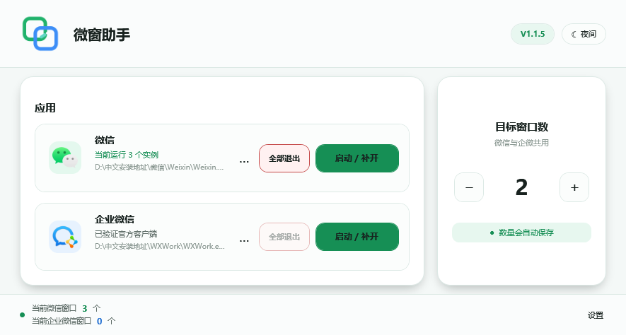
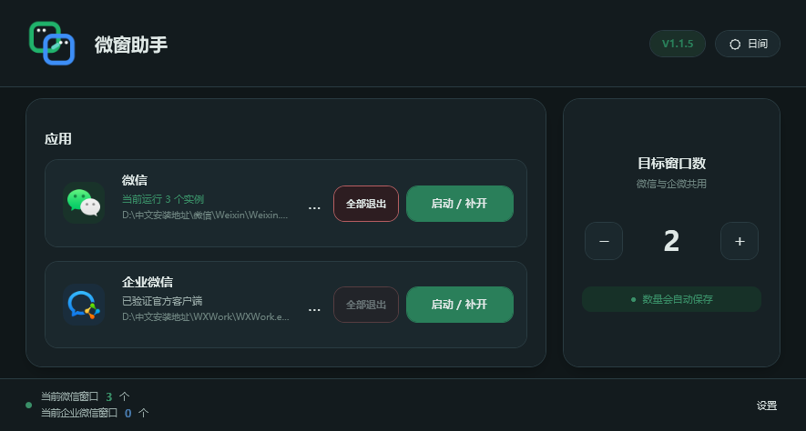
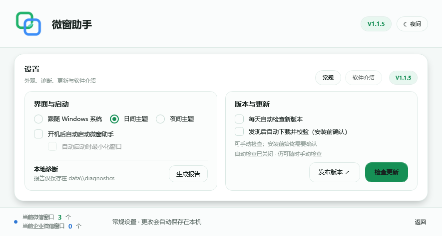
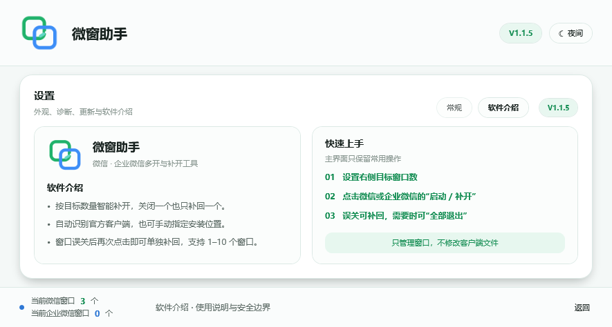
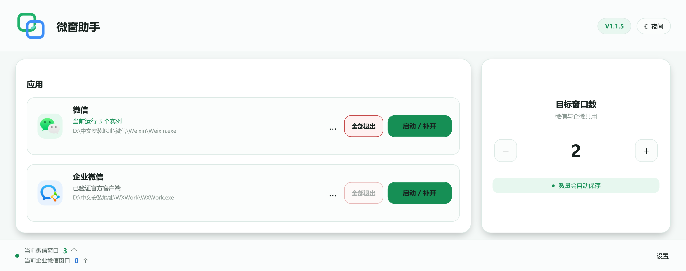
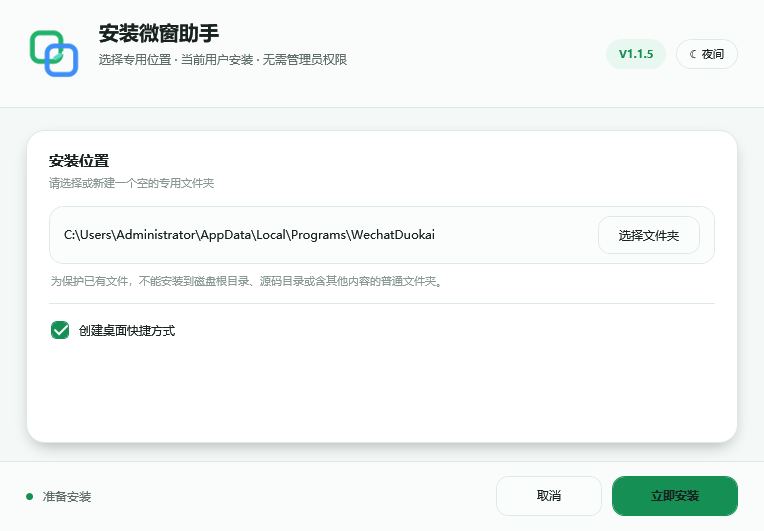
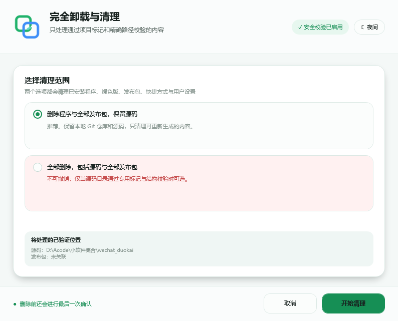

<p align="center">
  
</p>

<h1 align="center">微窗助手</h1>

<p align="center">
  一款轻量、透明、可核验的 Windows 微信与企业微信多开、补开工具
</p>

<p align="center">
  <a href="https://github.com/PascalePaF/wechat-wecom-duokai/releases/latest"><strong>下载最新版本</strong></a>
  · <a href="#三步上手">三步上手</a>
  · <a href="#安全与隐私边界">安全说明</a>
  · <a href="#常见问题">常见问题</a>
  · <a href="#从源码构建">从源码构建</a>
</p>

<p align="center">
  <a href="https://github.com/PascalePaF/wechat-wecom-duokai/releases"></a>
  <a href="https://github.com/PascalePaF/wechat-wecom-duokai/actions/workflows/windows-release-validation.yml"></a>
  
  
  <a href="LICENSE"></a>
</p>

<p align="center">
  <picture>
    <source media="(prefers-color-scheme: dark)" srcset="docs/assets/v1.1.5-main-dark-901x513.png">
    <source media="(prefers-color-scheme: light)" srcset="docs/assets/v1.1.5-main-light-901x513.png">
    
  </picture>
</p>

微窗助手会统计当前 Windows 用户会话中、来自同一官方程序路径的真实微信或企业微信窗口，并且只启动
距离目标数量还缺少的实例。目标是 3、误关 1 个时，再点一次只补回 1 个，不需要先退出其余窗口。

> [!IMPORTANT]
> 本项目基于 [CN-Root/wechat-wecom-duokai](https://github.com/CN-Root/wechat-wecom-duokai)
> 持续改进，不是腾讯官方产品。它不会修改、替换或破解微信与企业微信客户端文件。使用前请遵守客户端
> 许可、组织安全策略和账号风控规则。

## 下载

当前正式版本：**V1.1.5**。请只从本仓库的
[GitHub Releases](https://github.com/PascalePaF/wechat-wecom-duokai/releases/latest) 下载。

| 版本 | 适合谁 | 下载 |
| --- | --- | --- |
| 安装版（推荐） | 希望自选安装目录、创建快捷方式并使用完整卸载功能 | [下载 `wechat_duokai-setup-v1.1.5.exe`](https://github.com/PascalePaF/wechat-wecom-duokai/releases/download/v1.1.5/wechat_duokai-setup-v1.1.5.exe) |
| 绿色免安装版 | 希望解压即用，不写入安装登记 | [下载 `wechat_duokai-portable-v1.1.5.zip`](https://github.com/PascalePaF/wechat-wecom-duokai/releases/download/v1.1.5/wechat_duokai-portable-v1.1.5.zip) |
| 独立清理器 | 需要完整卸载，或清理本项目安装包与带标记的源码目录 | [下载 `wechat_duokai-cleanup-v1.1.5.exe`](https://github.com/PascalePaF/wechat-wecom-duokai/releases/download/v1.1.5/wechat_duokai-cleanup-v1.1.5.exe) |

发布核验资料：

- [SHA256SUMS.txt](https://github.com/PascalePaF/wechat-wecom-duokai/releases/download/v1.1.5/SHA256SUMS.txt)：正式附件 SHA-256 清单；
- [SPDX 2.2 SBOM](https://github.com/PascalePaF/wechat-wecom-duokai/releases/download/v1.1.5/manifest.spdx.json)：软件物料清单；
- [Kaspersky 原始扫描日志](https://github.com/PascalePaF/wechat-wecom-duokai/releases/download/v1.1.5/kaspersky-scan-v1.1.5.txt)：对正式发布原件的扫描记录；
- [V1.1.5 发布说明](https://github.com/PascalePaF/wechat-wecom-duokai/releases/tag/v1.1.5)：变化、限制和全部附件。

> [!CAUTION]
> 当前版本没有受公共信任的 Authenticode 代码签名，首次运行可能出现“未知发布者”、SmartScreen 或
> 第三方启发式信誉提示。提示不等于确认有病毒，也不能把“未检出”当作绝对安全证明。请核对下载域名、
> Release 标签和 SHA-256，保持安全软件开启；遇到明确告警时先隔离核查，不要盲目忽略或设置永久白名单。

## 三步上手

1. 打开微窗助手，在右侧用 `−` / `+` 设置目标窗口数；微信和企业微信共用这个 `1–10` 的目标值。
2. 点击对应客户端的“启动 / 补开”；程序会先统计现有窗口，只启动缺少的数量。
3. 某个窗口被误关后，再点一次对应按钮即可补回；要退出某一端的全部窗口，点击“全部退出”并确认。

没有自动识别客户端时，点击卡片中的 `…` 手动选择官方程序：微信为 `Weixin.exe` 或 `WeChat.exe`，
企业微信通常为 `WXWork.exe`。自定义程序必须通过腾讯 Authenticode 数字签名验证。

## 核心能力

| 能力 | 实际行为 |
| --- | --- |
| 按需补开 | 按“目标数量 − 当前根窗口数”补足，误关一个只补一个 |
| 微信与企微独立操作 | 两端分别启动、补开和全部退出，共用一个自动保存的目标数量 |
| 精确窗口统计 | 识别微信 4.x 多子进程结构，不把所有同名子进程误算成窗口 |
| 企业微信扩展模式 | 当前官方 5.0.11.6018 已实测三开，并带注册表崩溃恢复与外部冲突保护 |
| 官方客户端校验 | 自动定位或手动选择后，核对文件名、产品信息和腾讯数字签名 |
| 本地数据 | 设置、主题、诊断、恢复证据和更新临时文件统一位于程序目录 `data` |
| 日间与舒适夜间主题 | 支持跟随 Windows、固定日间或固定夜间；图标背景与状态色同步适配 |
| 开机自动启动 | 可选当前用户登录 Windows 后启动助手；可同时选择最小化，不会自动打开微信或企业微信 |
| 比例界面 | 901×513 起自由缩放到最大化，支持 Per-Monitor V2 DPI，不使用外层滚动条 |
| 确认式一键更新 | 可选发现版本后自动下载并校验；安装仍需确认，支持验证缓存复用、独立安装进程与失败回滚 |
| 可核验发布 | 源码标签、干净 Windows CI、哈希、SPDX SBOM、UI 回归矩阵与扫描日志公开 |

## V1.1.5 更新

- 设置新增当前用户“开机后自动启动”，可选自动启动时最小化；只启动助手，不会自动打开客户端；
- 绿色版移动后会修复由本程序拥有的启动路径；遇到第三方同名值会保留外部设置，卸载也只删除精确归属项；
- 更新检查在设置中显示上次成功与下次计划；可选发现新版后自动下载并完成多重 SHA-256 校验；
- 已验证更新包可安全复用，减少重复下载；安装前和执行前仍分别确认、重算哈希，不做静默覆盖；
- 设置页在 901×513 最小尺寸重新压缩信息层级，日间/夜间均无裁切，并补齐启动项、缓存篡改与清理边界测试。

完整变化见 [CHANGELOG.md](CHANGELOG.md)。

<details>
<summary><strong>查看夜间主题、设置页和大尺寸适配</strong></summary>










</details>

## 安装、绿色版与升级

### 安装版

1. 运行 `wechat_duokai-setup-v1.1.5.exe`；
2. 点击“选择文件夹”，选择或新建专用安装目录；
3. 选择是否创建桌面快捷方式，然后点击“立即安装”；
4. 如果旧版正在运行，安装器会询问是否关闭对应目录中的助手后覆盖；
5. 安装完成后不会自行启动，只有点击“确认并启动”才会运行。



### 绿色版

完整解压 ZIP 后运行 `wechat_duokai.exe`。不要只移动主 EXE，它需要同目录的
`WechatDuokai.Core.dll`、绿色版身份标记及随包文档。

### 一键更新

版本检查优先读取本项目 GitHub Release 的静态 `update-manifest.json`，不依赖未登录 API 的每小时
60 次配额。自动检查成功后缓存 24 小时，启动时随机错峰 30–300 秒，失败按 1/6/24 小时退避；手动检查
始终立即执行。

默认只有用户确认后才会下载 `SHA256SUMS.txt` 和对应安装包；也可以在设置中开启“发现后自动下载并校验”。
自动下载只准备经过验证的更新包，不会静默执行。静态清单、校验文件与本机下载必须一致；GitHub API
可用时还会交叉核验服务端附件摘要。已验证缓存会在再次安装时复核并复用，启动安装程序前仍会重算哈希。
安装版刷新安装登记，绿色版保持绿色身份，替换失败会回滚。

<details>
<summary><strong>查看代理和更新存储细节</strong></summary>

当前进程配置了规范 `HTTPS_PROXY` / `HTTP_PROXY` 环境变量时，版本检查和下载使用同一代理；代理地址和
凭据不会写入设置、诊断或日志。未配置环境代理时使用 Windows/.NET 默认代理。

下载内容只写入当前程序目录的 `data\updates`。更新程序只接受带本项目专用标记的安装版或绿色版目录，
不会把任意文件夹识别为可覆盖目标。

</details>

## 设置与本地数据

右下角“设置”包含：

- 跟随 Windows、日间、夜间三种主题；
- 当前用户开机自动启动，以及自动启动时是否最小化；
- 每天自动检查、发现后自动下载并校验、检查计划和手动检查；
- 本地诊断报告；
- 软件介绍与三步用法。

所有持久运行文件都在当前安装目录或绿色版目录的 `data` 中：

| 路径 | 内容 |
| --- | --- |
| `data\settings.ini` | 共用目标数量、已验证客户端路径、启动与更新偏好 |
| `data\theme.ini` | 主题偏好 |
| `data\update-state.ini` | 更新检查缓存与退避状态 |
| `data\diagnostics` | 用户主动生成的本地诊断报告 |
| `data\recovery` | 企业微信临时注册表状态的崩溃/断电恢复事务 |
| `data\logs` | 恢复过程与外部冲突保护日志 |

自定义路径采用 Base64 只是为了避免特殊字符破坏配置格式，不是加密；这些配置不包含账号、聊天内容或凭据。

## 安全与隐私边界

微窗助手的边界是“启动经过验证的官方客户端、处理已知单实例锁、统计窗口并执行用户确认的操作”。它：

- 不注入 DLL，不创建远程线程，不写客户端内存；
- 不修改、替换或破解微信、企业微信文件；
- 不读取聊天数据库、消息、联系人、Cookie、账号或登录凭据；
- 不上传设置、路径、诊断、恢复日志或使用数据；
- 不会在后台主动结束客户端，只有点击“全部退出”并确认后才关闭当前会话、精确路径匹配的对应程序；
- 只对腾讯签名验证通过的自定义客户端执行兼容操作；
- 诊断报告只保存在本地，是否分享及分享前如何脱敏由用户决定；
- 企业微信注册表临时状态具有落盘事务、异常恢复和外部冲突保护，不会用旧快照覆盖第三方的新值；
- 完整卸载只处理同时通过专用标记、目录结构、路径和链接检查的目标，删除源码还需要额外确认。

启用版本检查时，GitHub 会看到普通 HTTPS 请求所需的 IP 和 User-Agent；这是唯一默认可能发生的外部
网络访问。可以在设置中关闭每日检查与自动下载，手动检查仍由用户主动触发。开机自动启动只写入当前
Windows 用户的标准 `Run` 启动项；除这一项和安装版已有的卸载登记/快捷方式外，不在程序目录外保存运行文件。

安全资料：

- [V1.1.5 完整安全审计报告](docs/微窗助手_V1.1.5_完整安全审计报告.txt)
- [V1.1.5 一键更新安全验证报告](docs/V1.1.5-一键更新安全验证报告.md)
- [V1.1.5 全项目自查报告](docs/V1.1.5-全项目自查报告.md)
- [V1.1.5 UI 回归矩阵](docs/V1.1.5-UI回归矩阵.md)
- [源码与旧版二进制安全审计（历史）](SECURITY-AUDIT.md)
- [旧版 EXE 硬编码路径说明](docs/旧版EXE硬编码路径说明与风险评估报告.txt)

### 在 Windows 中核对 SHA-256

```powershell
Get-FileHash .\wechat_duokai-setup-v1.1.5.exe -Algorithm SHA256
```

将结果与同一 Release 中的 `SHA256SUMS.txt` 比较。文件名相同但哈希不同，不要运行。

## 企业微信多开说明

企业微信的 `multi_instances` 注册表入口只可靠表达双开。目标大于 2 时，本项目不会把 `3–10` 永久写入
注册表，而是在本次启动循环中使用短期策略并处理已知独占锁。当前 `WXWork 5.0.11.6018` 已验证三个
根窗口同时运行，但界面允许的 `4–10` 不代表所有企业微信版本、账号或组织策略都能实现。

修改注册表前会先把恢复事务强制写入 `data\recovery`。正常结束时恢复并删除；异常退出或断电后，下次
启动只在当前值仍等于本助手临时状态时恢复。第三方程序已经写入新值时会保留新值并记录冲突。

## 常见问题

<details>
<summary><strong>为什么安全软件提示风险或“未知发布者”？</strong></summary>

项目没有购买 Authenticode 证书，发布文件缺少公共信誉积累；多开工具还会启动多个客户端、访问进程锁和
短期调整企业微信注册表，这些行为可能触发启发式规则。请先核对来源和 SHA-256，再查看 Release 扫描日志
与源码。明确检测到具体恶意项时应先隔离，不要为了运行而关闭防护。

</details>

<details>
<summary><strong>设置成 10 就一定能打开 10 个窗口吗？</strong></summary>

不保证。`1–10` 是助手的目标范围，不是腾讯客户端的兼容性承诺。微信与企业微信可能在不同版本、账号、
组织策略或风控环境下改变限制。程序失败时会停止，不会转向注入或修改客户端文件。

</details>

<details>
<summary><strong>为什么一个微信窗口会看到多个微信进程？</strong></summary>

微信 4.x 的一个窗口本来就会产生多个同名子进程。本项目按照父子关系归并根实例，而不是把任务管理器里
所有同名进程都当成独立窗口。

</details>

<details>
<summary><strong>无法自动找到微信或企业微信怎么办？</strong></summary>

点击客户端卡片中的 `…` 选择官方 EXE。仍失败时进入“设置 → 本地诊断”生成报告，先自行检查其中的本地
路径等信息，再到 [Issues](https://github.com/PascalePaF/wechat-wecom-duokai/issues) 描述 Windows 版本、
客户端版本、复现步骤和实际提示。

</details>

<details>
<summary><strong>卸载会删除聊天记录吗？</strong></summary>

不会。清理器只删除带本项目专用标记且通过边界检查的助手目录、快捷方式、安装登记和发布包，不把微信或
企业微信的程序目录、数据目录作为卸载目标。选择“删除源码”时仍要注意未提交的本项目源码修改不可恢复。

</details>

## 完全卸载

从开始菜单“完全卸载”、Windows“已安装的应用”，或运行独立清理器进入：

1. **删除程序与全部发布包，保留源码**：删除已验证安装目录、快捷方式、安装包、绿色版和助手设置；
2. **全部删除，包括源码与全部发布包**：只有源码目录带正确标记且结构匹配时可选，还需要额外复选和确认。



## 兼容性与限制

- Windows 10/11 x64，.NET Framework 4.8；
- 支持微信旧版 `WeChat.exe`、微信 4.x `Weixin.exe` 和企业微信 `WXWork.exe`；
- 当前真机基线：微信 `4.1.15.6`、企业微信 `5.0.11.6018`、Windows 11 x64；
- 支持 100%、125%、150%、175%、200% 缩放和 Per-Monitor V2 跨屏 DPI；
- 不以客户端小版本号作为白名单，但腾讯调整锁机制、签名或组织策略后仍可能需要适配；
- 项目使用 WPF / .NET Framework 4.8，不需要 WinUI 3、Tauri、Python 或浏览器运行时。

## 从源码构建

需要 Visual Studio 2019 或更高版本、.NET Framework 4.8 Developer Pack、MSBuild，以及 Windows 10/11 x64。
项目没有第三方运行时包或 NuGet UI 依赖。

```powershell
MSBuild .\duokai.sln /restore /t:Rebuild /p:Configuration=Release
.\tests\bin\Release\net48\WechatDuokai.Tests.exe
PowerShell -ExecutionPolicy Bypass -File .\build-release.ps1 -Version 1.1.5
```

产物位于 `artifacts\V1.1.5`。构建脚本会重新编译、执行测试、分别打包 setup/cleanup、生成绿色版、
发布清单、静态更新清单和 SHA-256。GitHub Actions 会在全新的 Windows Server 2022 环境重复构建，
复核哈希并生成、验证 SPDX 2.2 SBOM。

<details>
<summary><strong>查看项目架构</strong></summary>

```text
主界面 MainWindow
├─ 比例缩放画布                   901×513 基准；统一缩放并按比例填满窗口
├─ 主界面 / 设置 / 软件介绍       同窗切换；实时计数、主题、说明、更新与下载进度
├─ ApplicationLocator             注册表、运行进程、官方常见目录与用户自选路径
├─ ClientExecutableValidator      文件名、产品信息和腾讯签名验证
├─ InstanceManager                根实例统计、增量启动和分端全部退出编排
│  ├─ IProcessEnvironment         进程枚举、父子关系、启动、等待与精确退出边界
│  ├─ IWeComLaunchPolicy          落盘事务、异常恢复、外部冲突检测和条件恢复
│  └─ WindowsHandleUnlocker       只处理已知单实例锁白名单
├─ ApplicationStorage             约束所有持久数据位于程序目录 data
├─ DiagnosticReportService        只写本地诊断报告
├─ ReleaseUpdateChecker           静态清单优先、严格 URL/大小和可选 GitHub digest
├─ UpdateCheckSchedule            缓存、错峰、退避和 Retry-After
├─ ApplicationUpdateService       自动准备、验证缓存复用、多重校验、事务更新和安装器交接
└─ WindowsStartupIntegration      当前用户启动项、移动修复、外部冲突保护和精确清理

发布程序
├─ setup                           安装、覆盖、安装版/绿色版事务更新和失败回滚
├─ cleanup                         卸载、完整清理和临时工作进程自删除
├─ build-release.ps1               重编译、测试、组包、清单和哈希
└─ GitHub Actions                  干净 Windows 重建、哈希复核和 SPDX SBOM
```

</details>

## 反馈与贡献

- 功能建议、兼容性问题和缺陷请提交到 [Issues](https://github.com/PascalePaF/wechat-wecom-duokai/issues)；
- 报告问题时建议提供 Windows 版本、微信/企业微信版本、复现步骤和实际提示；
- 诊断报告分享前请自行检查并遮盖不希望公开的本地路径；
- 欢迎提交 Pull Request。涉及进程、注册表、更新或删除边界的修改，应同时补充自动化测试和安全说明。

## 项目来源与许可证

- 上游项目：[CN-Root/wechat-wecom-duokai](https://github.com/CN-Root/wechat-wecom-duokai)
- 当前项目：[PascalePaF/wechat-wecom-duokai](https://github.com/PascalePaF/wechat-wecom-duokai)
- 完整版本历史：[CHANGELOG.md](CHANGELOG.md)
- 许可证：[Apache License 2.0](LICENSE)

项目继承上游许可证与版权声明。原作者及历次贡献者的署名予以保留。
