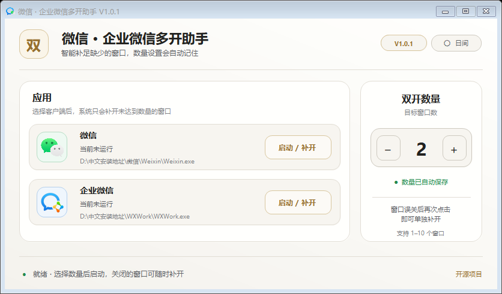
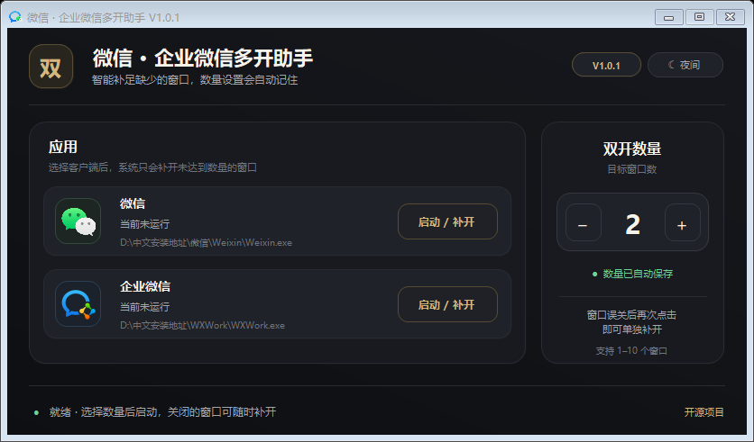
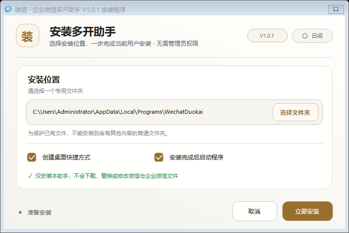
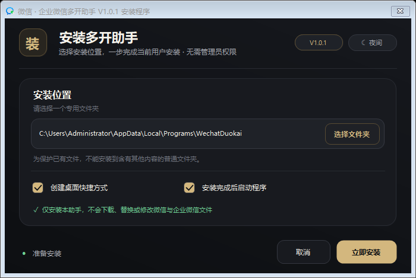
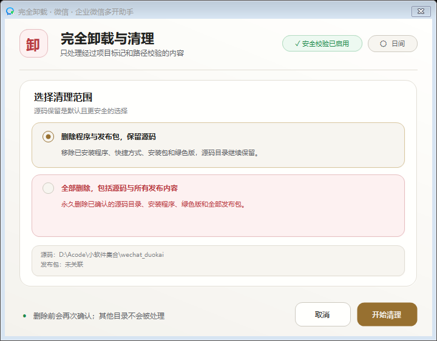
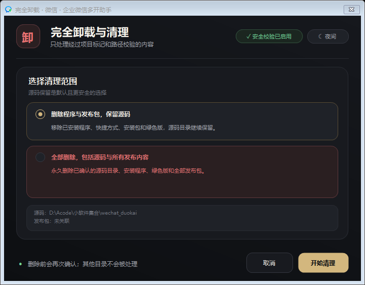

# 微信 · 企业微信多开助手

[](https://github.com/PascalePaF/wechat-wecom-duokai/releases)


[](LICENSE)

一个面向 Windows 10/11 的轻量级微信、企业微信多开与补开工具。它会识别当前已经运行的
真实客户端数量，只启动缺少的窗口，不需要为了补回一个误关窗口而退出全部客户端。

> 本项目基于 [CN-Root/wechat-wecom-duokai](https://github.com/CN-Root/wechat-wecom-duokai)
> 持续改进。不会下载、替换或修改微信和企业微信客户端文件。



<details>
<summary>查看夜间主题</summary>



</details>

## 为什么选择这个版本

| 能力 | 说明 |
| --- | --- |
| 按需补开 | 目标为 3、误关 1 个后，再次点击只补开缺少的 1 个 |
| 自动记忆数量 | 记住最近一次的目标窗口数，重启工具后无需重新输入 |
| 自动查找客户端 | 综合注册表、运行中进程和官方常见目录识别安装位置 |
| 双客户端支持 | 微信与企业微信分别检测、计数和启动，互不干扰 |
| 自选安装地址 | 安装器通过 Windows 文件夹选择器选择位置，不需要手动输入路径 |
| 两种发行方式 | 提供 Windows 安装版和绿色免安装 ZIP |
| 可核验发布 | 每个正式版本提供源码标签、SHA-256、自动测试结果和卡巴斯基扫描日志 |
| 安全完整卸载 | 可保留源码清理全部程序，也可在严格校验和二次确认后删除整个项目 |

## V1.0.1 更新重点

- 主程序、安装器和完整卸载器采用统一的简约视觉体系，支持日间/夜间主题即时切换并记忆选择。
- 三个窗口全部恢复 Windows 原生标题栏，可直接拖动、最小化和关闭，不再使用不可移动的无边框窗口。
- 安装地址改为只读显示框和“浏览…”按钮，通过系统文件夹选择器设置。
- 自定义安装位置加入防误删规则：拒绝磁盘根目录、系统关键目录、目录联接、源码目录、
  发布目录和未标记的非空目录。
- 新增《旧版 EXE 硬编码路径说明与风险评估报告》，说明固定本机路径的含义、影响和风险。
- 对上游源码、旧版 EXE、当前源码、构建链、运行端点和删除边界完成扩展安全审计。
- 公开记录一次 `VHO:Trojan.Win32.Convagent.gen` 中间构建告警及后续调查，不把启发式判定简单写成“已确认误报”。
- 构建脚本改为按版本号统一生成文件名、清单和校验值。

完整变更记录见 [CHANGELOG.md](CHANGELOG.md)。

## 下载

请从 [GitHub Releases](https://github.com/PascalePaF/wechat-wecom-duokai/releases) 下载正式版本。

| 文件 | 适用场景 |
| --- | --- |
| `wechat_duokai-setup-v1.0.1.exe` | 推荐；可选择本机安装地址，并加入开始菜单和“已安装的应用” |
| `wechat_duokai-portable-v1.0.1.zip` | 绿色版；解压后直接运行，不写入安装注册信息 |
| `wechat_duokai-cleanup-v1.0.1.exe` | 独立完整卸载与清理工具 |
| `SHA256SUMS.txt` | 核对下载文件是否完整、是否与发布者提供的文件一致 |
| `kaspersky-scan-v1.0.1.txt` | Kaspersky 对该版本发布目录的完整扫描日志（同时查看日志内病毒库日期） |

本项目暂未配置商业代码签名证书。首次运行时，Windows 或安全软件可能显示未知发布者/信誉提示；
请只从本项目 Release 下载，并先核对 SHA-256。审计期间曾出现一次通用启发式云端告警，后续
源码、反编译、运行观察和强制扫描没有找到恶意链条；详情、证据和病毒库限制请先阅读
[完整安全审计报告](SECURITY-AUDIT.md)。不要为了运行本工具而关闭安全软件或设置永久白名单。
本次最终发布目录门禁处理 30 个对象：30 正常、0 检测、0 可疑、0 跳过、0 错误；扫描时
完整病毒库日期为 `2026-09-11 00:57:00`，产品同时提示病毒库已过期且在线更新 TLS 失败。

## 快速开始

### 安装版

1. 下载并运行 `wechat_duokai-setup-v1.0.1.exe`。
2. 点击“浏览…”，选择或新建一个专用安装文件夹。
3. 选择是否创建桌面快捷方式、安装后是否启动，然后点击“立即安装”。



<details>
<summary>查看夜间主题安装器</summary>



</details>

### 绿色版

1. 解压 `wechat_duokai-portable-v1.0.1.zip` 到独立文件夹。
2. 运行 `wechat_duokai.exe`。
3. 不要只把 EXE 单独移出绿色版目录；保留标记和清理工具，才能使用完整卸载功能。

## 使用方法

1. 在界面最右侧设置希望保持的目标窗口数，范围为 1–10。
2. 点击对应客户端左侧图标或“启动 / 补开”。
3. 程序会统计现有实例，并只启动缺少的部分。
4. 若之后关闭了其中一个客户端，再次点击同一按钮即可补开。

数量设置保存在 `%LOCALAPPDATA%\WechatDuokai\settings.ini`。该目录带有本项目专用标记，
完整卸载时会经过精确校验。程序不会读取聊天记录、消息内容、账号或登录凭据。

## 工作原理

```text
主界面
├─ ApplicationLocator      查找微信 / 企业微信真实安装路径
├─ InstanceManager         归并子进程并计算真实客户端实例数
│  └─ WindowsHandleUnlocker 仅处理白名单内的单实例锁
└─ UserPreferences         保存目标窗口数

安装与卸载
└─ InstallerEngine
   ├─ 嵌入并校验 Release 主程序
   ├─ 创建快捷方式和当前用户卸载信息
   └─ 使用专用标记与精确路径规则执行完整清理
```

微信 4.x 的一个窗口可能包含多个同名子进程，因此不能直接把进程总数当作窗口数。
本项目会沿进程父子关系归并为客户端根实例，再根据“目标数量 - 当前实例数”计算需要补开的数量。

## 安全设计

本项目明确遵守以下边界：

- 不注入 DLL，不创建远程线程。
- 不修改、替换或破解微信和企业微信程序文件。
- 不结束微信或企业微信进程。
- 不读取聊天数据库、聊天记录、账号、Cookie 或登录凭据。
- 不在后台上传本地数据。
- 仅关闭白名单内的已知单实例互斥锁，或精确匹配微信 4.x `lock.ini` 的文件句柄。
- 企业微信仅写入当前用户下的 `HKCU\SOFTWARE\Tencent\WXWork\multi_instances` 配置值。
- 卸载只接受带专用标记、路径结构匹配且不是磁盘根目录的目标；不会凭文件夹名称猜测删除范围。

安全资料：

- [源码与旧版二进制安全审计](SECURITY-AUDIT.md)
- [完整安全审计与卡巴斯基告警调查报告（TXT）](docs/微信企业微信多开助手_V1.0.1_完整安全审计报告.txt)
- [旧版 EXE 硬编码路径说明与风险评估报告](docs/旧版EXE硬编码路径说明与风险评估报告.txt)

反病毒“未检出”是重要参考，但不等于绝对安全保证。源码、标签、构建脚本、哈希和扫描日志同时
公开，是为了让每个发布文件都能够被独立复核。

## 完全卸载

可以从开始菜单的“完全卸载”、Windows“已安装的应用”，或独立清理工具进入：



<details>
<summary>查看夜间主题完整卸载器</summary>



</details>

1. **删除程序与全部发布包，保留源码**：删除安装目录、快捷方式、安装包、绿色版和用户设置，
   保留 Git 仓库与源码。
2. **全部删除，包括源码与全部发布包**：只有在源码目录含正确安全标记且项目结构匹配时才会启用；
   还必须额外勾选确认，并通过最后一次对话框确认。

第二种操作不可撤销。源码已推送到 GitHub 时仍可重新克隆，但未提交的本地修改无法从 GitHub 恢复。

## 从源码构建

### 环境

- Visual Studio 2019 或更高版本
- .NET Framework 4.8 Developer Pack
- MSBuild
- Windows 10/11 x64

### 编译与测试

```powershell
MSBuild .\duokai.sln /t:Rebuild /p:Configuration=Release
.\tests\bin\Release\WechatDuokai.Tests.exe
```

### 生成完整发布包

```powershell
PowerShell -ExecutionPolicy Bypass -File .\build-release.ps1 -Version 1.0.1
```

脚本会依次重新编译、执行自动验证、创建安装版和绿色版、生成发布清单与 SHA-256。
输出目录为 `artifacts\V1.0.1`。

## 兼容性与限制

- 微信、企业微信可能在未来版本调整单实例机制；客户端升级后建议先使用测试账号验证。
- 自动检测覆盖注册表、已运行进程和常见安装目录；极少数定制路径尚未提供手动选择客户端 EXE 的入口。
- 本机验收环境：微信 `4.1.15.6`、企业微信 `5.0.11.6018`、Windows 11。
- 本机微信的 3 个窗口会产生 15 个同名子进程；当前计数逻辑可正确归并为 3 个实例。
- 请遵守微信、企业微信许可协议，以及所在组织关于客户端多开的规定。

## 参与项目

欢迎通过 [Issues](https://github.com/PascalePaF/wechat-wecom-duokai/issues) 提交兼容性问题或改进建议。
报告问题时建议附上 Windows 版本、客户端版本、安装方式、实际现象和可复现步骤；请先删除账号、
路径中的个人信息，不要上传聊天数据或凭据。

## 版本与来源

- 上游项目：[CN-Root/wechat-wecom-duokai](https://github.com/CN-Root/wechat-wecom-duokai)
- 改进项目：[PascalePaF/wechat-wecom-duokai](https://github.com/PascalePaF/wechat-wecom-duokai)
- V1.0.0：目标数量缓存、按需补开、安装版/绿色版与完整清理
- V1.0.1：可视化选择安装地址、原生可移动窗口、日间/夜间主题、扩展安全审计与版本化发布流程

## 许可证

项目继承上游的 [Apache License 2.0](LICENSE)。原作者与历次贡献者的版权声明予以保留。
